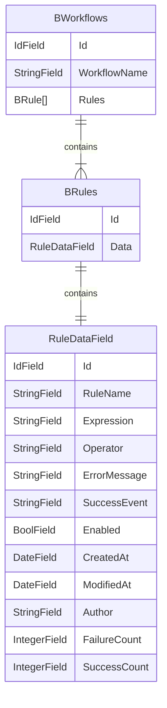

```mermaid
erDiagram
    BWorkflows ||--}| BRules : contains
    BWorkflows {
        IdField Id
        StringField WorkflowName
        BRule[] Rules
        
    }
    BRules ||--|| RuleDataField : contains
    BRules {
        IdField Id
        RuleDataField Data
    }
    RuleDataField {
        IdField Id
        StringField RuleName 
        StringField Expression
        StringField Operator
        StringField ErrorMessage
        StringField SuccessEvent
        BoolField Enabled
        DateField CreatedAt
        DateField ModifiedAt
        StringField Author
        IntegerField FailureCount
        IntegerField SuccessCount
    }
```
