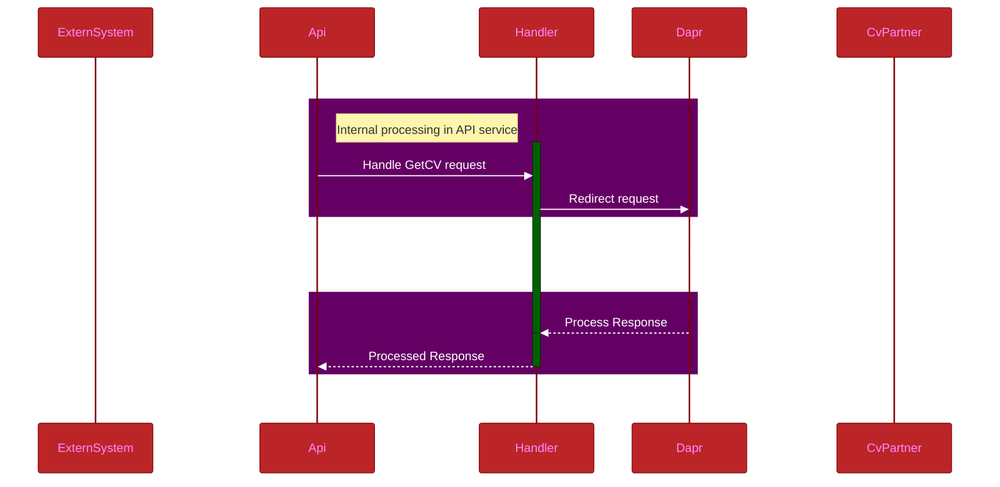
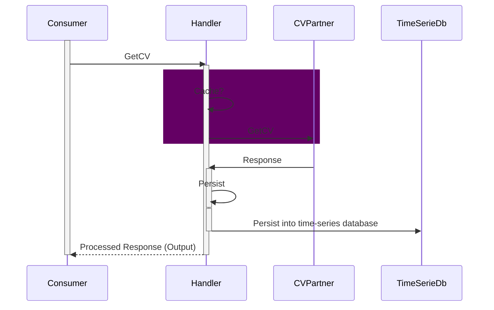

# API - Bouvet CV Service

## Define Bouvet CV schema

CV Partner is an external system with its own data structure. Bouvet need its own schema

## GetCv

- Specification:
Should provide data structure consistent to Bouvet CV schema (Bouvet CV schema is a part of the scope of this Thesis)
- Why:
<!--https://mermaid.js.org/config/theming.html#sequence-diagram-variables-->

## Persist Bouvet CV

- Specification:
Should persist if CV have changes since last persisted date.
Should persist if CV is newly created
- Why:
To be able to query faster and without any restrictions (e.g. how many request per time interval)

## Persist Bouvet CV in time series Database
