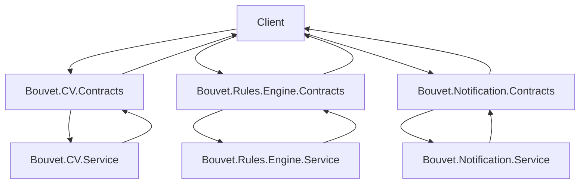

# API Contract

## What is an API Contract?

An API Contract is a way to specify how communication between the client and the server should persist. It is created by the developers and acts as a common language on how API should communicate. These conditions are requirements that must be met to use the API, otherwise, the request will receive an error response. An example could be to define which properties a JSON object should have. Another example might be a fast food restaurant. The menu is the API Contract, it specifies what you can order and what you can't. If you order something that is not on the menu, you will not get it. If you order something that is on the menu, you will get it.

## Why is an API Contract important?

An API Contract is important because it allows the client to know what to expect from the server. It also allows the server to know what to expect from the client. This allows for more efficient communication between the client and the server. Including a more efficient way, it also includes a more secure way. If the client and the server know what to expect from each other, they can also know what to expect from the data. This allows for a more secure way of communication.

## Our approach to creating API contracts

(To be written)

- Maybe create an OPENAPI document for each service?

## Communication between services using API Contracts

