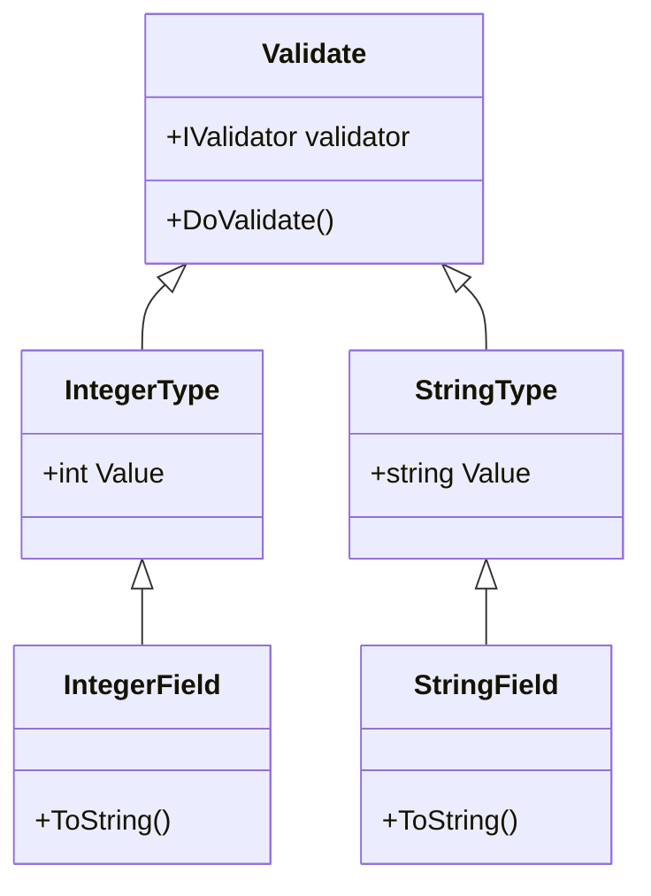

# Base Entities Flow Chart

```mermaid
classDiagram
Validate <|-- IntegerType
Validate <|-- StringType
Validate : +IValidator validator
Validate : +DoValidate()
class IntegerType{
    +int Value
}
class StringType{
    +string Value
}
IntegerType <|-- IntegerField
StringType <|-- StringField
class IntegerField{
    +ToString()
}
class StringField{
    +ToString()
}
```
