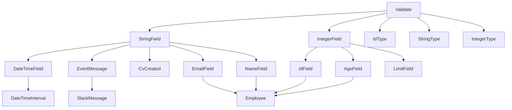

# Entities flow chart

```mermaid
graph TD 
Validate --> StringField
Validate --> IntegerField
Validate --> IdType
Validate --> StringType
Validate --> IntegerType
StringField --> DateTimeField
StringField --> EventMessage
StringField --> CvCreated
EventMessage --> SlackMessage
DateTimeField --> DateTimeInterval
IntegerField --> IdField
IntegerField --> AgeField
StringField --> EmailField
StringField --> NameField
IntegerField --> LimitField
IdField --> Employee
NameField --> Employee
AgeField --> Employee
EmailField --> Employee
```
