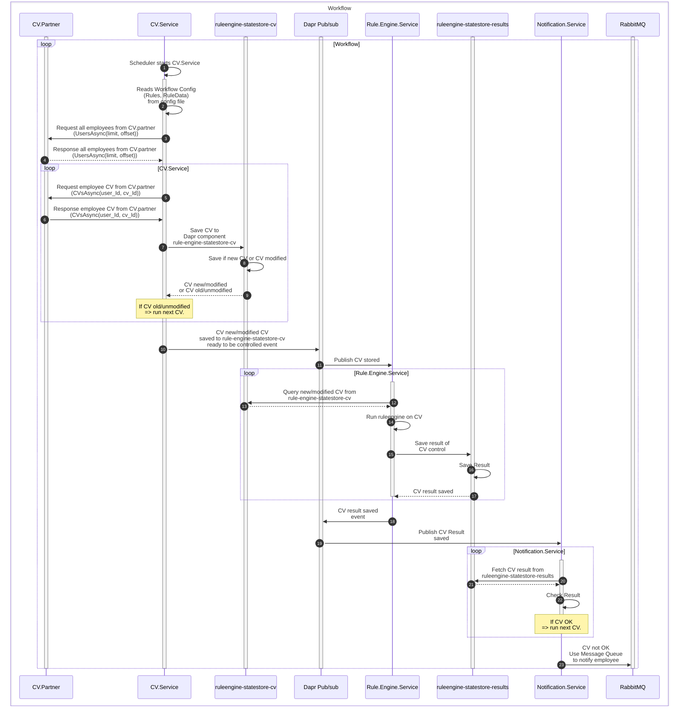

# Mitm2Client Sequence Diagram

```mermaid
sequenceDiagram
    autonumber
    box transparent Workflow
    participant CV.Partner
    participant CV.Service
    participant ruleengine-statestore-cv
    participant Dapr Pub/sub
    participant Rule.Engine.Service
    participant ruleengine-statestore-results
    participant Notification.Service
    participant RabbitMQ
    end

    activate CV.Partner
    activate ruleengine-statestore-cv
    activate ruleengine-statestore-results
    activate Dapr Pub/sub
    activate RabbitMQ
    loop Workflow
    CV.Service->>CV.Service: Scheduler starts CV.Service
    activate CV.Service
    CV.Service->>CV.Service: Reads Workflow Config<br>(Rules, RuleData)<br>from config file
    CV.Service->>CV.Partner: Request all employees from CV.partner<br>(UsersAsync(limit, offset))
    CV.Partner-->>CV.Service: Response all employees from CV.partner<br>(UsersAsync(limit, offset))
        loop CV.Service
            CV.Service->>CV.Partner: Request employee CV from CV.partner<br>(CVsAsync(user_Id, cv_Id))
            CV.Partner->>CV.Service: Response employee CV from CV.partner<br>(CVsAsync(user_Id, cv_Id))
            CV.Service->>ruleengine-statestore-cv: Save CV to<br>Dapr component<br>rule-engine-statestore-cv
            ruleengine-statestore-cv->>ruleengine-statestore-cv: Save if new CV or CV modified
            ruleengine-statestore-cv-->>CV.Service: CV new/modified<br> or CV old/unmodified
            Note over CV.Service: If CV old/unmodified<br>=> run next CV.
        end
        CV.Service->>Dapr Pub/sub: CV new/modified CV<br>saved to rule-engine-statestore-cv<br>ready to be controlled event
        Dapr Pub/sub->>Rule.Engine.Service: Publish CV stored
        loop Rule.Engine.Service
            activate Rule.Engine.Service
            Rule.Engine.Service->>ruleengine-statestore-cv: Query new/modified CV from<br>rule-engine-statestore-cv
            ruleengine-statestore-cv-->>Rule.Engine.Service: 
            Rule.Engine.Service->>Rule.Engine.Service: Run ruleengine on CV
            Rule.Engine.Service->>ruleengine-statestore-results: Save result of<br>CV control
            ruleengine-statestore-results->>ruleengine-statestore-results: Save Result
            ruleengine-statestore-results-->>Rule.Engine.Service: CV result saved
            deactivate Rule.Engine.Service
        end
        Rule.Engine.Service->>Dapr Pub/sub: CV result saved<br>event
        Dapr Pub/sub->>Notification.Service: Publish CV Result<br>saved
        loop Notification.Service
            activate Notification.Service
            Notification.Service->>ruleengine-statestore-results: Fetch CV result from<br>ruleengine-statestore-results
            ruleengine-statestore-results-->>Notification.Service: 
            Notification.Service->>Notification.Service: Check Result
            Note over Notification.Service: If CV OK<br>=> run next CV.
            deactivate Notification.Service
        end
            Notification.Service->>RabbitMQ: CV not OK<br>Use Message Queue<br>to notify employee
    end
    deactivate CV.Service
    deactivate CV.Partner
    deactivate ruleengine-statestore-cv
    deactivate ruleengine-statestore-results
    deactivate Dapr Pub/sub
    deactivate RabbitMQ
```
