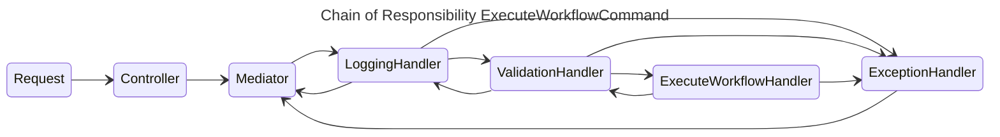
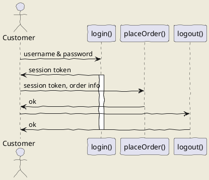

# Chain of Responsibility

## What is the Chain of Responsibility?

Chain of Responsibility is a behavioral design pattern. It makes it possible to pass requests along a chain of handlers. Upon receiving a request, each handler decides if it wants to process the request and whether the request is to be sent to the next handler in the chain.

## Why do we use Chain of Responsibility behavioral design pattern?

Chain of Responsibility is used when we want to decouple the sender of a request from its receiver, in other words, loose coupling. It allows us to send a request to a chain of handlers without knowing which handler will process it. The request is sent to the first handler in the chain and then it is passed along the chain until it is handled.
Using this behavioral design pattern also increases flexibility. It allows us to add handlers to the chain without changing the code of the existing handlers.

## Problems with Chain of Responsibility

The main problem with Chain of Responsibility is that it can be difficult to debug. If a request is not handled, it can be difficult to find out why. This is because the request is passed along the chain until it is handled. If it is not handled, it will not be passed along the chain.
Another problem is that we cannot guarantee that each request is handled, and will be dropped.

## Our approach to using Chain of Responsibility

(To be written)

- What have we done to mitigate some of these problems

## Rules Engine Chain of Responsibility

