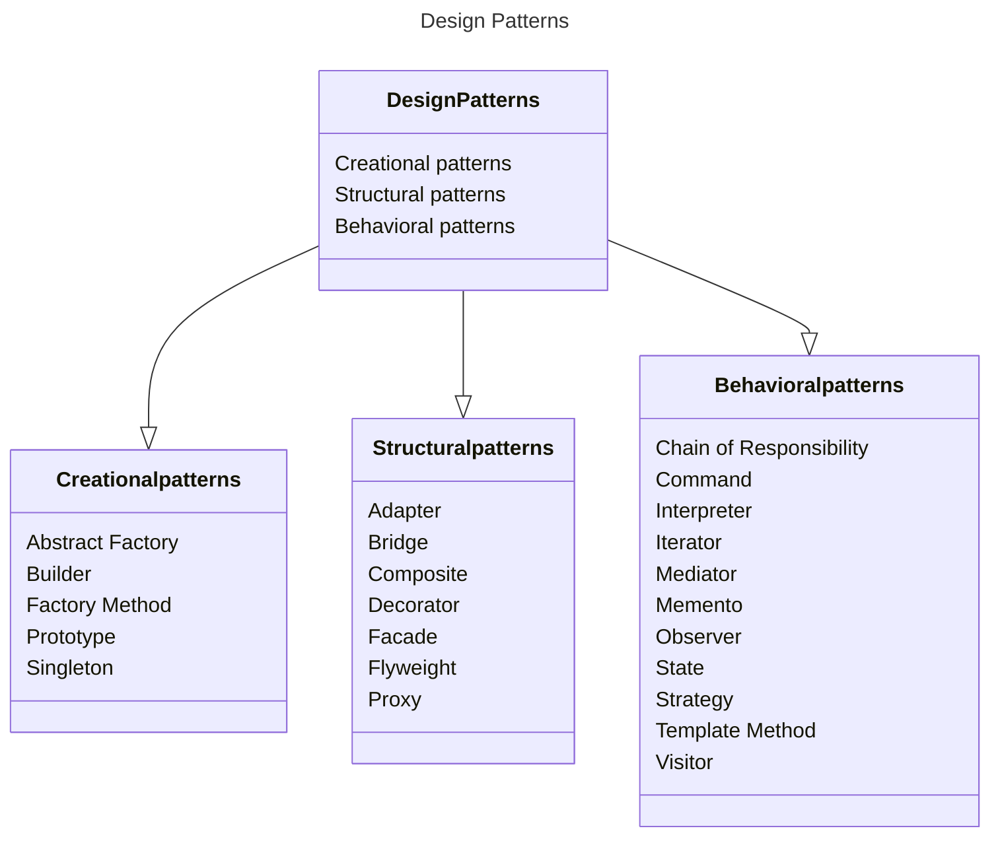

# Design Patterns

## What is C# design pattern?

A design pattern is a general repeatable solution to a commonly occurring problem in software design. In a software application lifecycle, the developer will encounter many recurring problems. Design Patterns are a way to solve these problems in a way that is reusable and maintainable. But the pattern is not a specific code but rather a concept for solving a problem. Patterns are sometimes confused with algorithms, but they are not the same. An algorithm is a specific set of steps to solve a problem, while a pattern is a general concept for solving a problem. An analogy is that an algorithm is a recipe for a cake, while a pattern is a concept or the blueprint for a cake. The recipe contains detailed steps on how to make it but in the blueprint one can see the result and its features, but the implementation is left to the chef.

## Types of design patterns

### Creational patterns

Creational patterns are design patterns that deal with object creation mechanisms, which try to increase the reuse and flexibility of existing code.

### Creational patterns used in the bachelor thesis

(To be written)

## Structural patterns

Structural patterns are design patterns that ease the design by identifying a simple way to realize relationships between entities.

### Structural patterns used in the bachelor thesis

(To be written)

## Behavioral patterns

Behavioral patterns are design patterns that identify common communication patterns between objects and assign responsibilities between objects.

### Behavioral patterns used in the bachelor thesis

(To be written)

## Benefits of using design patterns

Design patterns are a way to solve problems in a way that is reusable and maintainable. They are also a way to communicate with other developers about the design of the code and achieve a common language that all the team members can understand. Design patterns are also a way to improve the quality of the code since these patterns have been tried and tested for common problems. e.g. the Singleton pattern is a way to ensure that only one instance of a class is created. This is useful when we want to ensure that only one instance of a class is created, e.g. a database connection.

## Drawbacks of using design patterns

Design patterns are not a silver bullet. They are not a solution to all problems. They are a way to solve common problems, but they are not a solution to all problems. One of the largest problems is their unjustified use. If you are a fan of these patterns you might try to apply them everywhere even when the problem does not need this, and the simpler and better solution where simpler code is the better option. There is a saying in the software architect sphere that "If all you have is a hammer, everything looks like a nail" (Glenn Henriksen).
Another drawback is that using patterns requires extensive knowledge, so if you are not familiar with the patterns you might not be able to use them effectively, or you might not be able to use them at all. It then requires a lot of studying these patterns to be able to use them effectively.

## How have we used the design patterns in the bachelor thesis

(To be written)

## Why did we choose these design patterns?

(To be written)
