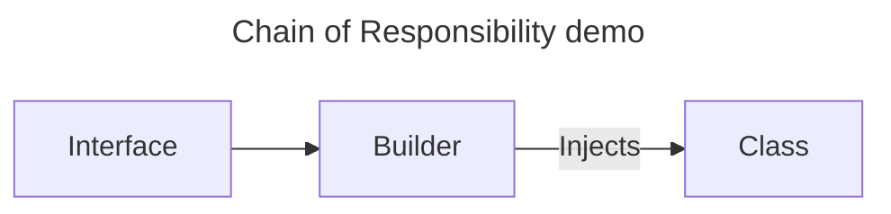

# Inversion of Control

## What is Inversion of Control?

Inversion of Control (IoC) is a design principle. The component or module receives its dependencies from an external source rather than creating them itself. This decouples the component from its dependencies. In IoC, it transfers control of object creation and management to a container or framework. The developer provides the container with instructions on how to create and manage objects, but the container is responsible for actually performing those actions.

IOC is often achieved with Dependency Injection (DI). DI is a technique in which the dependencies of an object are passed from another source to the object rather than the object creating them itself. This is in contrast to traditional programming, where the object creates its own dependencies.

An example of DI one can imagine you are making coffee. To coffee machine needs coffee beans, water, milk, and sugar. Instead of storing the beans, water milk, and sugar, it is provided to the machine when it is supposed to make coffee so it created exactly what type of coffee you would like, even if it is an americano or a cappuccino.

## Why is Inversion of Control important?

Firstly Inversion of Control allows for loose coupling between objects since objects are provided their dependencies at runtime, rather than having to create them themselves. This makes code more flexible and easier to maintain since it is easier to change dependencies. Secondly, IoC makes it easier to test code, since it is easier to mock or even replace the dependencies. Lastly, IoC makes it easier to reuse the code, since we can modify the behavior of an object by changing the dependency.

## How did we acheive IoC in our bachelor thesis?

(To be written)

- DI

