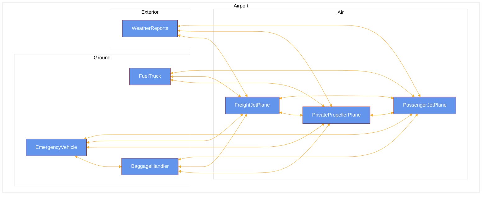
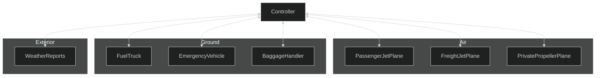
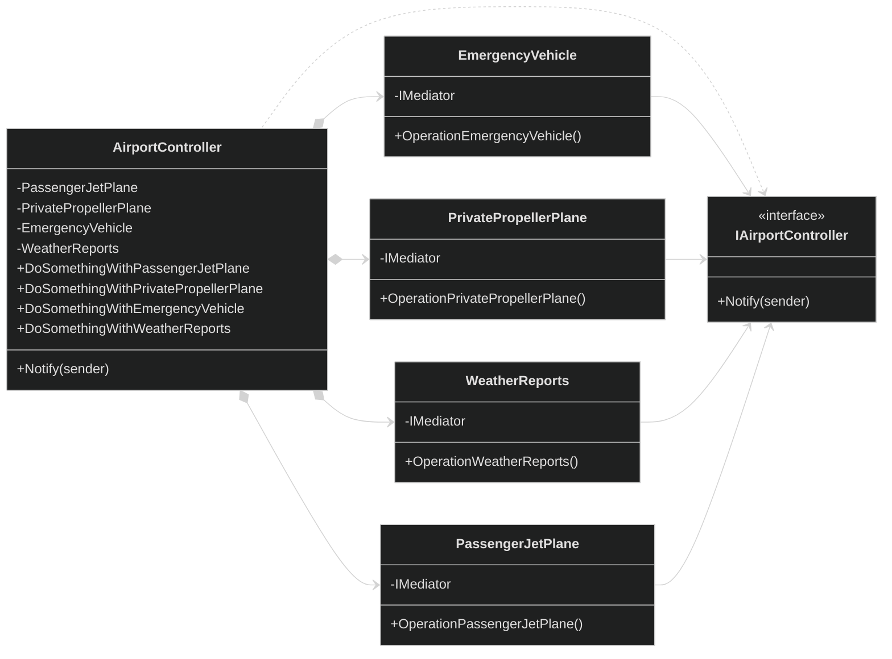
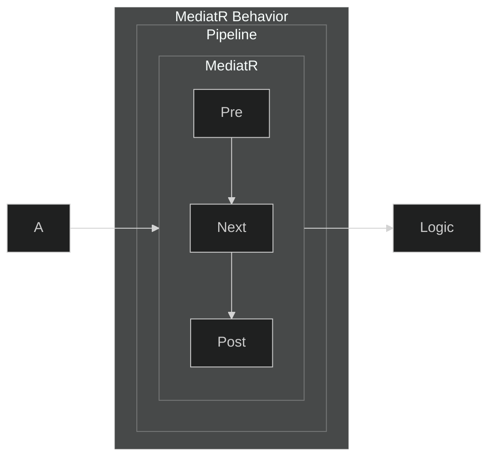
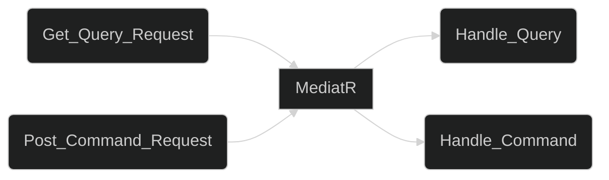

# Mediator Behavioral Design Pattern

## Core

In simple terms, a mediator could also be explained as a man-in-the-middle. A mediator is used to restrict the direct communications between objects and only let them cooperate via a mediator object.

## Why use the Mediator pattern

The mediator approach reduces tight couplings between objects, which makes code easier to test, change and debug. The use of a mediator also reduces the dependencies in each class, as the the only dependency each class have is the mediator.

## Without a mediator

We can illustrate this using an airport as a real world example:

From the airport example above using arrows as the dependencies, we can derive that is is not a very good system. On modern airports there is one or more controllers which monitors and directs all the different objects(vehicles) on the airport. Let us take a look at what it would look like if we were using a mediator like an airportcontroller.

## With a mediator

The figure above illustrates much better coordination using a mediator. Every message has to go through the mediator which transfers the message to the correct object. In this instance the controller passes messages between vehicles and services on an airport.

## Structure

The structure of a mediator consists of components, the mediator interface and the concrete mediator. The components, also known as classes, contains reference to the mediator through the mediator interface. The concrete mediator encase the relations between the various classes/components. We can illustrate this using the airport example. The mediator interface is referred to as IAirportController while the concrete mediator is AirportController:

## MediatR Behaviors

## Implementation in project

(To be written..)
