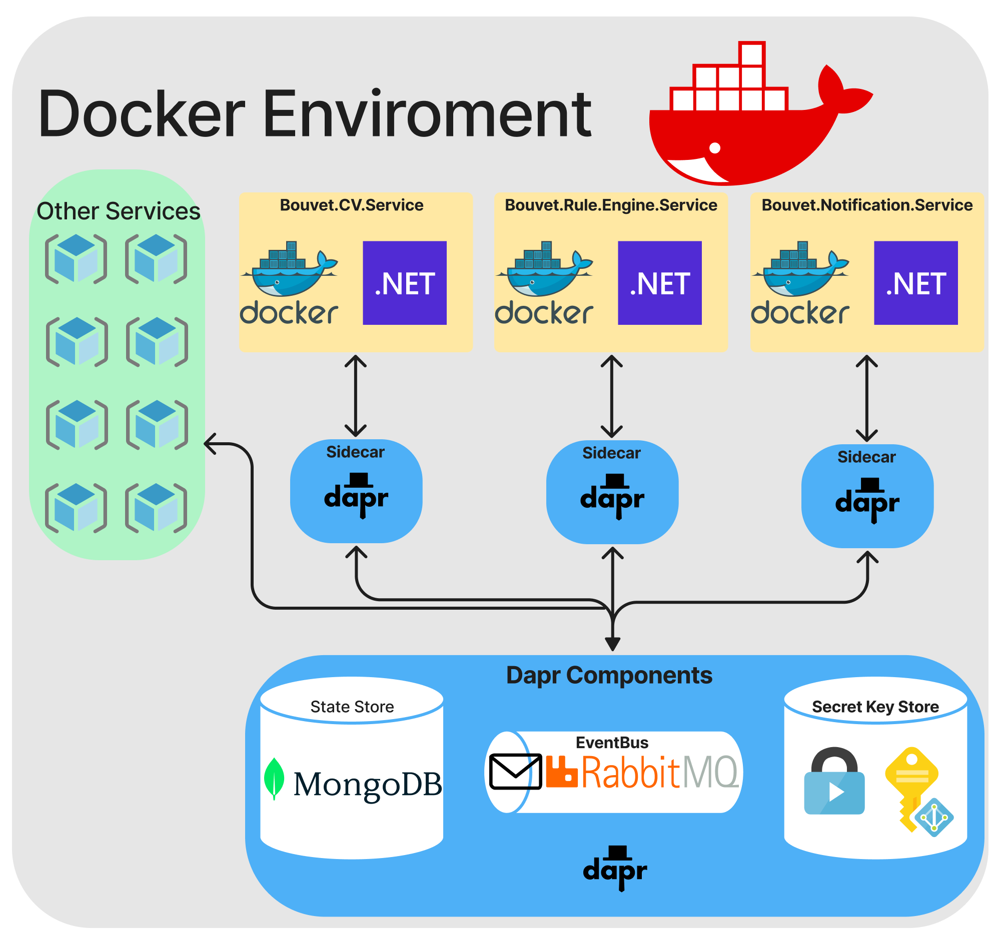

# Develop a generic Rules Engine to quality control a CV database
## Abstract
This application is a thesis project in collaboration with Bouvet. We introduce a software solution to quality control employee CVs at Bouvet. The software uses the API of CV Partner, where the resumes are stored, to fetch the CVs and employs a Rules Engine to run validation checks, ensuring that the CVs are consistently updated regarding the employees' information, skills, and experiences. This approach enhances the appeal of Bouvet's workforce to potential clients, enabling the company to showcase its team's expertise and competitive edge in the market. This study aims to underscore the significance of incorporating CV management solutions in the dynamic consultancy landscape by analyzing the system's design, development, and potential impact.
## Note
Please note that since our thesis project was initially developed on a secure GitHub repository within the Bouvet organization, we have extracted our code to a public-friendly format. As a result, the commit history and other relevant information is not be available in this public repository.
## Description
The program is comprised of several utilities, including the Fields library which is a custom type library, and a Generic rules engine. Additionally, the program consists of three microservices - the **Bouvet.Rule.Engine.Service**, **Bouvet.Notification.Service**, and **Bouvet.CV.Service**.
## Components and Services
| Service       | Description                                                                 |
| --------------|-----------------------------------------------------------------------------|
| Bouvet.CV.Service | A service that fetches CVs from CV Partner and executes the rules engine. |
| Bouvet.Rule.Engine.Service | A service that executes the rules engine based on a given workflow. |
| Bouvet.Notification.Service | A service that mocks an event to an external event bus for employees to be notified. |
| Seq           | A logging service that aggregates logs from our microservices.              |
| Zipkin        | A distributed tracing system that allows us to track requests across services.|
| Grafana       | A monitoring service that allows us to visualize metrics from our services.  |
| RabbitMQ      | A message broker that allows us to send messages between our services.       |
| Redis         | A key-value store that allows us to store data in memory.                    |
| Dapr          | A distributed application runtime that provides a set of building blocks for developing microservices-based applications.|
| MongoDB       | A document database that allows us to store data in a JSON-like format.      |
| MongoExpress  | A web-based MongoDB admin interface that allows us to view and edit data in our database.|
| Prometheus    | A monitoring service that allows us to collect metrics from our services.    |
| Grafana       | A monitoring service that allows us to visualize metrics from our services.  |
| Webstatus     | A web application that allows us to view the status of our services.         |
| DocFX         | A documentation generator that allows us to generate documentation for our codebase.|
| mssql         | A relational database that allows us to store data in a tabular format.      |
## Getting Started

To get started with the Bouvet CV Quality Control Program, you will need to have Docker installed on your machine. Once Docker is installed, you can run the application using **docker-compose**.

There are two modes that the application can be run in - development and staging. If you are running the application in development mode, you will need to set the **ENVIRONMENT** environment variable to Development in the **docker-compose.yml** file. This will disable the autonomous CV fetching process and will allow the application to run without the need for cookies and an X-CSRF token.

If you are running the application in staging mode, you will need to set the **ENVIRONMENT** environment variable to Staging in the **docker-compose.yml** file. This will enable the autonomous CV fetching process, execute the rules engine based on the given workflow, and mock an event to an external event bus for employees to be notified.

To start the application, navigate to the root directory of the project and run the following command:

```bash
docker-compose up
```
This will start all of the services defined in the docker-compose.yml file. Once the services are up and running, you can interact with them using the provided APIs or by sending HTTP requests directly to the services.

Documentation/Images/Architecture.png
## Architecture


Our application is built on a microservice architecture, which allows us to decompose the system into smaller, more manageable services that can be developed and deployed independently. We also use Event-Driven Architecture (EDA) and Command Query Responsibility Segregation (CQRS) patterns to further decouple the different components of our system and improve scalability and resilience.

To facilitate communication between our microservices, we utilize Dapr, a distributed application runtime that provides a set of building blocks for developing microservices-based applications. Dapr allows us to use a variety of messaging protocols and provides features like service discovery, pub/sub messaging, and state management.

In terms of design patterns, we have implemented several patterns to improve the maintainability and extensibility of our codebase. For example, we use the Chain of Responsibility pattern to handle requests that may require multiple handlers to process. We also use the Factory pattern to encapsulate object creation, the Mediator pattern to decouple the communication between objects, and the Options pattern to configure objects with different sets of options.
## Usage and Examples
Our rules engine service is a generic service that can be used to evaluate any set of rules against a given input. However, our primary use case is to use the service to perform quality control checks on CVs in our database.

External users who do not have access to the necessary cookies and tokens will not be able to see the full autonomous process of fetching the CVs and executing the rules engine. However, users are still able to test the rules engine service and provide your own input with your chosen workflow. This can be done by utilizing the swagger UI provided by the **Bouvet.Rule.Engine.Service**.
## Grapfana
To view our Grafana dashboard, you first need to make sure that you have composed up all of our services. Once you have done this, you can visit the Grafana web interface.

To connect to the Prometheus database in the data source settings, you should set the URL to http://prometheus:9090.

Then, you can import the dashboard by navigating to the Dashboard section in the Grafana web interface and selecting "Import" from the menu. The JSON file for our Grafana dashboard can be found in the root folder of our application.

**Note** that some metrics may not show up on the Grafana dashboard when external users are using our program, as we have limited access for security reasons. Additionally, some metrics may not have been generated yet, depending on the usage of the application.
## Testing
Our application has a testing strategy in place, which includes a combination of unit and integration tests. We use unit tests to test individual components of our application, while integration tests are used to test the interactions between different components.


## File Structure
```
.
├───.github
│   └───workflows
├───dapr
│   ├───components
│   └───configuration
├───docfx_project
│   ├───api
│   ├───articles
│   ├───obj
│   │   └───.cache
│   │       └───build
│   │           └───atzj5naw.aua
│   └───_site
│       ├───api
│       ├───articles
│       ├───fonts
│       └───styles
├───Documentation
│   ├───Bouvet.Cv.Service
│   ├───Bouvet.Rule.Engine.Service
│   │   └───Rules
│   ├───CustomTypes
│   ├───Dapr
│   ├───Features
│   │   └───API
│   ├───FlowCharts
│   ├───InfoAndLinks
│   ├───Mitm2Client
│   │   └───SequenceDiagrams
│   ├───Patterns
└───src
    ├───libraries
    │   ├───fields
    │   │   ├───Entities
    │   │   │   ├───Base
    │   │   │   │   ├───Fields
    │   │   │   │   │   ├───Base
    │   │   │   │   │   ├───Collections
    │   │   │   │   │   ├───Custom
    │   │   │   │   │   ├───Dates
    │   │   │   │   │   ├───Net
    │   │   │   │   │   └───Primitive
    │   │   │   │   ├───FieldsConfiguration
    │   │   │   │   ├───Validation
    │   │   │   │   └───Validators
    │   │   │   ├───HttpServices
    │   │   │   │   └───CVPartnerService
    │   │   │   │       ├───Configuration
    │   │   │   │       ├───CvHttpClient
    │   │   │   │       └───Extensions
    │   │   │   ├───PartialClasses
    │   │   │   └───ServiceCollectionExtentions
    │   │   ├───Extensions
    │   │   ├───Factories
    │   │   ├───FluentValidation
    │   │   │   └───Rules
    │   │   ├───Messages
    │   │   └───Project Items
    │   └───general
    │       ├───Contracts
    │       │   ├───Bouvet.CV.Service
    │       │   │   ├───Commands
    │       │   │   ├───DTOs
    │       │   │   └───Events
    │       │   └───Bouvet.Rule.Engine.Service
    │       │       ├───Commands
    │       │       ├───DTOs
    │       │       └───Events
    │       │           └───Validators
    │       ├───Documentation
    │       ├───Extentions
    │       │   ├───BRulesEngine
    │       │   │   ├───ExtentionMethods
    │       │   │   └───Rules
    │       │   │       ├───BusinessRules
    │       │   │       │   └───Metrics
    │       │   │       └───Core
    │       │   │           ├───Engine
    │       │   │           ├───Entities
    │       │   │           ├───Factory
    │       │   │           ├───Fields
    │       │   │           ├───Interfaces
    │       │   │           └───Validators
    │       │   └───DotNetCore
    │       │       ├───Communication
    │       │       │   └───Dapr
    │       │       ├───ExceptionHandling
    │       │       ├───HealthChecks
    │       │       ├───Logging
    │       │       └───Mediator
    │       │           └───PipelineBehaviours
    │       └───Properties
    ├───services
    │   ├───Bouvet.CV.Service
    │   │   ├───BackgroundService
    │   │   ├───Dapr
    │   │   ├───Domain
    │   │   │   ├───Commands
    │   │   │   │   ├───AddRule
    │   │   │   │   ├───DeleteRule
    │   │   │   │   └───ModifyRule
    │   │   │   ├───Events
    │   │   │   │   └───WorkflowFinishedEvent
    │   │   │   ├───Queries
    │   │   │   │   ├───GetCollectionOfCVs
    │   │   │   │   ├───GetCV
    │   │   │   │   ├───GetRule
    │   │   │   │   └───GetWorkflow
    │   │   │   └───Services
    │   │   ├───Infrastructure
    │   │   │   ├───Configuration
    │   │   │   └───DBContext
    │   │   ├───Metrics
    │   │   └───Properties
    │   ├───Bouvet.Notification.Service
    │   │   ├───Domain
    │   │   │   ├───WorkflowFinishedEvent
    │   │   │   └───WorkflowStartedEvent
    │   │   ├───Metrics
    │   │   └───Properties
    │   ├───Bouvet.Rule.Engine.Service
    │   │   ├───.vscode
    │   │   ├───BackroundService
    │   │   ├───Domain
    │   │   │   ├───Commands
    │   │   │   │   └───ExecuteWorkflow
    │   │   │   └───Queries
    │   │   ├───Metrics
    │   │   └───Properties
    │   ├───CV.Partner.Service
    │   │   ├───Contracts
    │   │   ├───Controllers
    │   │   ├───Models
    │   │   └───Properties
    │   └───TimeSeries
    │       ├───CVtimeline
    │       └───Properties
    ├───tests
    │   ├───Bouvet.CV.Service.Test
    │   │   ├───IntegrationTests
    │   │   └───UnitTests
    │   │       └───BackgroundService
    │   ├───Bouvet.Notification.Service.Test
    │   │   ├───IntegrationTests
    │   │   └───UnitTests
    │   ├───Bouvet.Rule.Engine.Service.Test
    │   │   ├───Factories
    │   │   ├───IntegrationTests
    │   │   ├───TestData
    │   │   └───UnitTests
    │   │       ├───BackgroundService
    │   │       ├───Commands
    │   │       │   └───ExecuteWorkflow
    │   │       └───Query
    │   ├───Fields.Tests
    │   │   ├───Entities
    │   │   │   └───Fields
    │   │   ├───Extenstions
    │   │   └───Helpers
    │   └───Library.Tests
    │       ├───Factories
    │       ├───RulesEngine
    │       │   ├───BuisnessRules
    │       │   └───Engine
    │       └───TestData
    └───web
        └───WebStatus
            └───Properties
```
