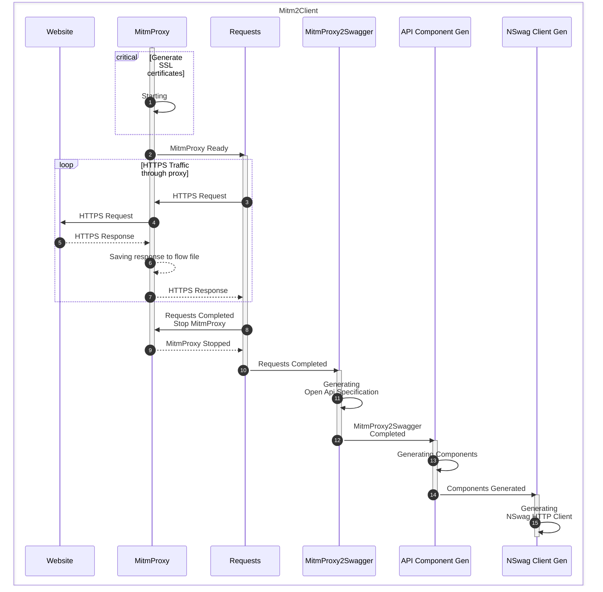

# Mitm2Client Sequence Diagram

```mermaid
sequenceDiagram
    autonumber
    box transparent Mitm2Client
    participant Website
    participant MitmProxy
    participant Requests
    participant MitmProxy2Swagger
    participant API Component Gen
    participant NSwag Client Gen
    end

    activate MitmProxy
    critical Generate SSL certificates
        MitmProxy->>MitmProxy: Starting
    end
    MitmProxy->>Requests: MitmProxy Ready
    activate Requests
    loop HTTPS Traffic through proxy
        Requests->>MitmProxy: HTTPS Request
        MitmProxy->>Website: HTTPS Request
        Website-->>MitmProxy: HTTPS Response
        MitmProxy-->>MitmProxy: Saving response to flow file
        MitmProxy-->>Requests: HTTPS Response
    end
    Requests->>MitmProxy: Requests Completed<br>Stop MitmProxy
    MitmProxy-->>Requests: MitmProxy Stopped
    deactivate MitmProxy
    Requests->>MitmProxy2Swagger: Requests Completed
    deactivate Requests
    activate MitmProxy2Swagger
    MitmProxy2Swagger->>MitmProxy2Swagger: Generating<br>Open Api Specification
    MitmProxy2Swagger->>API Component Gen: MitmProxy2Swagger<br>Completed
    deactivate MitmProxy2Swagger
    activate API Component Gen
    API Component Gen->>API Component Gen: Generating Components
    API Component Gen->>NSwag Client Gen: Components Generated
    deactivate API Component Gen
    activate NSwag Client Gen
    NSwag Client Gen->>NSwag Client Gen: Generating<br>NSwag HTTP Client
    deactivate NSwag Client Gen

```
